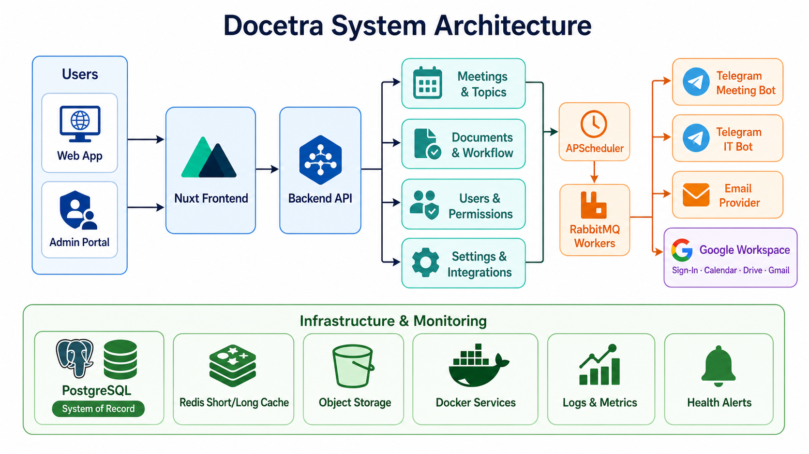
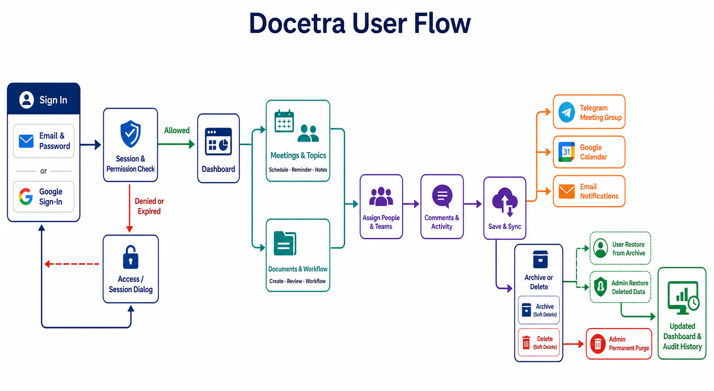

# Docetra Backend Prompts

Backend and API **system flow** specs for each major product area. They complement `prompt/specification/` and match the implemented UI in `frontend/`.





**Product source of truth:** `prompt/idea/`, `prompt/specification/` (`06-api-contracts.md`, `07-data-model.md`, module docs).

When this folder and the engineering spec disagree on architecture or API shape, `prompt/specification/` **wins**. When the spec is silent on screen-specific behavior, these files define the intended backend contract. When a path or JSON key disagrees with the Nuxt adapters, **the frontend adapter wins** until a versioned change is agreed.

**Build status:** the Docker-only FastAPI backend is implemented in `backend/` following [`06-backend-file-structure.md`](./06-backend-file-structure.md). `compose.backend.yml` runs the API, worker, scheduler, PostgreSQL, Redis, RabbitMQ, and MinIO.

Delivery window (from `project-management/01-timeline-management.md`): 24 August–13 November 2026. API freeze gate: 11 September 2026.

---

## Module index

Start with [`00-integration-contract.md`](./00-integration-contract.md) for the canonical session, permission, status, assignment, localization, response, and deployment rules shared by every module.

Then read [`01-cache-and-messaging.md`](./01-cache-and-messaging.md) for Redis short/long cache tiers, RabbitMQ jobs, retry/dead-letter behavior, and cache invalidation.

Meeting timing must follow [`02-meeting-scheduler.md`](./02-meeting-scheduler.md): APScheduler determines when work is due and RabbitMQ workers perform the durable side effects.

Email and the two separate Telegram bots follow [`03-notifications-and-integrations.md`](./03-notifications-and-integrations.md).

Archive, restore, soft delete, administrator purge, activity, and comments follow [`04-lifecycle-retention-and-collaboration.md`](./04-lifecycle-retention-and-collaboration.md).

Optional future Google Sign-In, Calendar, Drive, and Gmail behavior follows [`05-google-workspace-integration.md`](./05-google-workspace-integration.md). Every capability is disabled by default and enabled independently.

Scaffold and cutover:

| Doc | Role |
| --- | --- |
| [`06-backend-file-structure.md`](./06-backend-file-structure.md) | FastAPI tree, process entrypoints, router ↔ frontend adapter map |
| [`07-datetime-and-list-query.md`](./07-datetime-and-list-query.md) | UTC storage, ISO JSON, `startDate`/`endDate`, `record_time`, meeting TZ |
| [`08-implementation-sequence.md`](./08-implementation-sequence.md) | Sprint-aligned build order; first vertical slice |

| Area                | Doc                                                                                      | Routes (summary)                                                                             |
| ------------------- | ---------------------------------------------------------------------------------------- | -------------------------------------------------------------------------------------------- |
| **Meeting**         | [`modules/meeting-topic-board.md`](./modules/meeting-topic-board.md)                     | `/meetings/topics`, `/meetings/history`                                                      |
| **Record**          | [`modules/record-workflow-boards.md`](./modules/record-workflow-boards.md)               | `/records/incoming-documents`, `outgoing-documents`, `documents`, `master-list-requests`, `logs` |
| **Organization**    | [`modules/organization-master-data.md`](./modules/organization-master-data.md)           | `/organizations/departments`, `companies`, `company-purposes`, `company-sectors`, `officers` |
| **Portal**          | [`modules/portal-operations.md`](./modules/portal-operations.md)                         | `/portal/file-uploads`, `google-drive-sync`, `drive-files`, `logs`                           |
| **User management** | [`modules/user-management.md`](./modules/user-management.md)                             | `/users/roles`, `/users`                                                                     |
| **Configuration**   | [`modules/configuration-record-metadata.md`](./modules/configuration-record-metadata.md) | `/configuration/record-types`, `record-attributes`                                           |
| **Settings**        | [`modules/settings-application.md`](./modules/settings-application.md)                   | `/settings/app-info`, `app-config`, `storage`                                                |

**Related (not duplicated here):** System Log — `/system/logs` (read-only audit, same list pattern as portal logs).

---

## End-to-end flow (how areas connect)

```text
Configuration (record types / attributes / stages / localization)
        │
        ▼
Record boards & documents ◀── App Config (card fields, page size)
        │     └── form selects: companies, departments, officers
        │
        ├── Attachments ──▶ Settings (storage providers)
        │
Organization (dept / company / officer) ──▶ Record parties + User↔Officer
        │
Portal (upload / Drive sync) ──▶ Drive file catalog ──▶ Meeting notes link
        │
User Management (roles / users) ──▶ permissions on every API
        │
Settings (email / telegram / system flags) ──▶ notifications & read-only mode
```

### Record form quick reference (see record-workflow-boards.md §3)

| Kind                           | Create/edit fields                                                                                                                                                      |
| ------------------------------ | ----------------------------------------------------------------------------------------------------------------------------------------------------------------------- |
| Incoming / Outgoing / Document | Status, Title, Document type (company), Letter no./subject, Date, DG/Director dates, Involved office/officers, External units, Tags — **no** Record flow / content blob |
| Master List Request            | Status, Title, Record time, Record tag only                                                                                                                             |

---

## Frontend integration

- **Entity CRUD:** `frontend/app/adapters/createEntityAdapter.ts` + `config/entities.ts`
- **Configuration / Settings:** `useConfigurationRepositories()`, `useSettingsRepositories()`
- **Special boards:** `meeting-board`, `useRecordStageBoard`, `useRecordLogBoard`, `AppFileUploadBoard`
- **Toggle API:** `NUXT_PUBLIC_USE_MOCK_DATA=false` → HTTP repos and same paths in `api-endpoints.ts`

Each module doc ends with a **Frontend contract** section listing key files.

## Current frontend-to-API security contract

This version is frontend-complete with mock repositories and is ready for HTTP adapters. Backend implementation must preserve these boundaries:

- Authenticate every `/api/v2` request and enforce the exact namespaced capability for the action. Browser route/action checks are never authoritative.
- Return the user's flattened capability list as `permissions` (and `pageAccess` for compatibility). `ALL_PAGES` is reserved for a trusted super-admin policy.
- Use JWT HttpOnly cookies: `docetra_session` (access) and `docetra_refresh` (refresh). Redis `jwt:{jti}` binds CSRF and enables instant revoke. `/auth/me` is the capability probe; `/auth/refresh` rotates `jti`. Do not return JWTs in JSON or store bearer tokens in local storage.
- Reject authenticated uploads or API calls directed outside the configured API origin. CORS is explicit allow-list configuration; do not use wildcard credentialed CORS.
- Enforce upload count, size, extension, detected MIME, malware scanning, tenant ownership, and storage policy server-side. Never trust browser `accept` or MIME values.
- Recheck record and field permissions for list, schema, search, comments, workflow transitions, and asynchronous exports. Redact inaccessible dynamic field definitions and values.
- Use immutable audit events for permission, configuration, upload, stage, comment, and sensitive settings actions.
- Support bounded pagination/cursors, cancellation-safe idempotency, optimistic version conflicts, and async export/job polling rather than unbounded responses.

The FastAPI app lives in `backend/` and runs through `compose.backend.yml` (API, worker, scheduler). Nuxt always calls this API (`NUXT_PUBLIC_AUTH_MODE=cookie`, `NUXT_PUBLIC_API_BASE=http://localhost:8000`). Production must use unique `SESSION_SECRET`/`JWT_SECRET` and must not depend on mock credentials or localStorage datasets.

For development, run Nuxt on the local computer and all backend services from `compose.backend.yml`; see `frontend/docs/local-frontend-docker-backend.md`. The full normative boundary is [`00-integration-contract.md`](./00-integration-contract.md).

---

## Reading order for implementers

1. `prompt/specification/00-overview.md` + `02-domain-model.md`
2. `prompt/backend/00-integration-contract.md` — shared frontend/backend boundary
3. `prompt/backend/06-backend-file-structure.md` — where code will live
4. `prompt/backend/07-datetime-and-list-query.md` — dates, filters, `record_time`
5. `prompt/backend/08-implementation-sequence.md` — sprint-sized slices
6. This folder — module matching your feature area
7. `prompt/frontend/README.md` — route → component map
8. `prompt/specification/06-api-contracts.md` — global REST conventions
